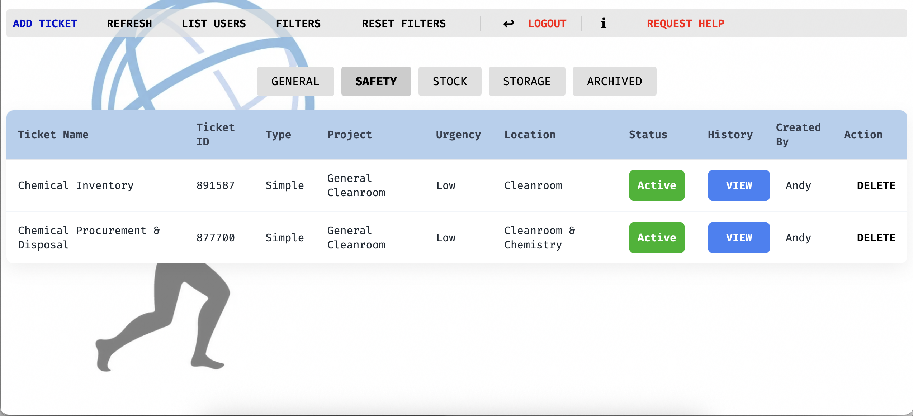
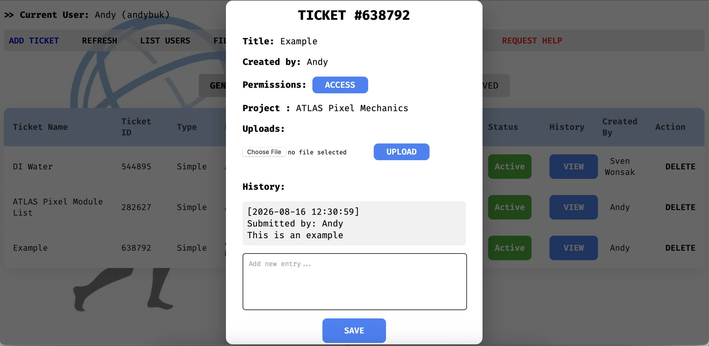

# Ticket Manager (Flask)
## v1.1.0
Desktop ticketing database system that supports end-to-end lifecycle ticket management. Allows creation of
individual safety, stock and general workplace events through with resolution tracking between all users.
Designed to support issue reporting with a structured and auditable workflow.

Designed specifically for Linux.

## Details
  
  

## Table of Contents
- [Installation](#installation)
- [Usage](#usage)
- [Images](#images)
- [License](#license) 

## Installation
1. **Clone the respository**  
   ```bash
   git clone https://github.com/4ndybuk/TicketManager
   cd TMFlask
   ```
3. **Install the dependencies**    
   ```bash
   pip install -r requirements.txt
   ```
4. Create an .env file in the directory to initialise the database  
   ```bash
   nano ./.env
   ```
5. Assign the following environmental variables in .env  
   ```bash
   SECRET_KEY=generate a key
   FLASK_DENUG=0/1 (development/production)
   ACCESS_CODES=code1,code2,...
   MAIL=yourmail@yourdomain
   ```
6. Ensure you have a WSGI server like waitress in your virtual environment
   ```bash
   pip install waitress
   ```	
7. Run the server as a background systemd service 
   ```bash
   a. sudo micro /etc/systemd/system/ticketmanager.service
   
   b. Paste the following and amend sections to your own directory paths:
   
   [Unit]
   Description=Flask Ticket Manager
   After=network.target
   
   [Service]
   Type=simple
   User=“your local machine username (you can check with hostname command)”
   WorkingDirectory=/directory_to_your_flask_app
   EnvironmentFile=/directory_to_your_flask_app/.env
   ExecStart=/directory_to_your_flask_app/venv/bin/waitress-serve --host=0.0.0.0 --port=8000 app:app
   Restart=on-failure
   RestartSec=10
   
   # Logging
   StandardOutput=journal
   StandardError=journal
   SyslogIdentifier=flask-ticketmanager
   
   # Security Hardening
   PrivateTmp=true
   ProtectSystem=no
   ProtectHome=false
   ReadWritePaths=/directory_to_your_flask_app/instance /directory_to_your_flask_app/logs
   
   [Install]
   WantedBy=multi-user.target

   c. Reload the daemon and start the service
   sudo systemd daemon-reload
   sudo systemd start ticketmanager.service

   d. Check the service is running fine
   sudo systemctl status ticketmanager
   sudo journalctl -u ticketmanager -f
   ```
8. Install nginx for reverse proxy and handing certificates
   ```bash
   a. sudo apt install nginx

   b. Configure your own SSL/TLS certificates on the local machine
   
   c. Configure nginx default
   sudo micro /etc/nginx/sites-available/default

   d. Paste:
   # Redirect HTTP to HTTPS
   server {
       listen 80;
       listen [::]:80;
       server_name your_server_domain;
   
       location / {
           return 301 https://$host$request_uri;
       }
   }
   
   # HTTPS with self-signed certificate
   server {
       listen 443 ssl;
       listen [::]:443 ssl;
       http2 on;
       server_name your_server_domain;
   
       client_max_body_size 100M;
   
       ssl_certificate /certificate_directory/cert.pem;
       ssl_certificate_key /certificate_directory/key.pem;
   
       location / {
           proxy_pass http://127.0.0.1:8000;
           proxy_set_header Host $host;
           proxy_set_header X-Real-IP $remote_addr;
           proxy_set_header X-Forwarded-For $proxy_add_x_forwarded_for;
           proxy_set_header X-Forwarded-Proto $scheme;
       }
   }
   ```
9. Check everything is running fine
   ```bash
   sudo nginx -t
   ```
## Usage
1. **Ticket Management System** - Create, update, and delete tickets, with support for multi-user access and management
2. **Advanced Filtering** - Filter tickets by name, project, and location using built-in search functionality
3. **Inline Ticket Actions**  
    Perform actions directly from each row:
    - Toggle ticket status between "Active" and "Completed"
    - Edit and store ticket details in View
## Images
   

## License
1. This project is licensed under the Non-Commerical License - see the [LICENSE](LICENSE) file for details.
